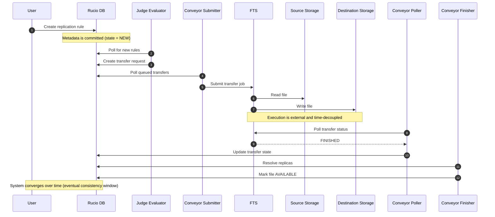

# Rucio Transfer Orchestration

## Overview

High-level overview of how Rucio daemons coordinate transfer execution,
state reconciliation, and eventual consistency across distributed storage systems.

## Transfer Lifecycle

## Eventual Consistency Model

Rucio is a **decoupled, multi-worker, state-driven workflow system**.

Independent daemons coordinate through shared database state and external systems (FTS, storage), producing **eventual consistency through staged progression**, rather than immediate end-to-end transaction completion.

Key property:

> Work is propagated via persistent state transitions, not synchronous execution chains.

## Operational Implications

- Temporary state divergence is expected (DB ≠ storage reality)
- Polling intervals directly affect convergence latency
- Failures are handled via retry + reprocessing loops
- Recovery is daemon-driven, not request-driven
- Concurrent execution introduces non-deterministic timing but deterministic final state (in healthy conditions)
